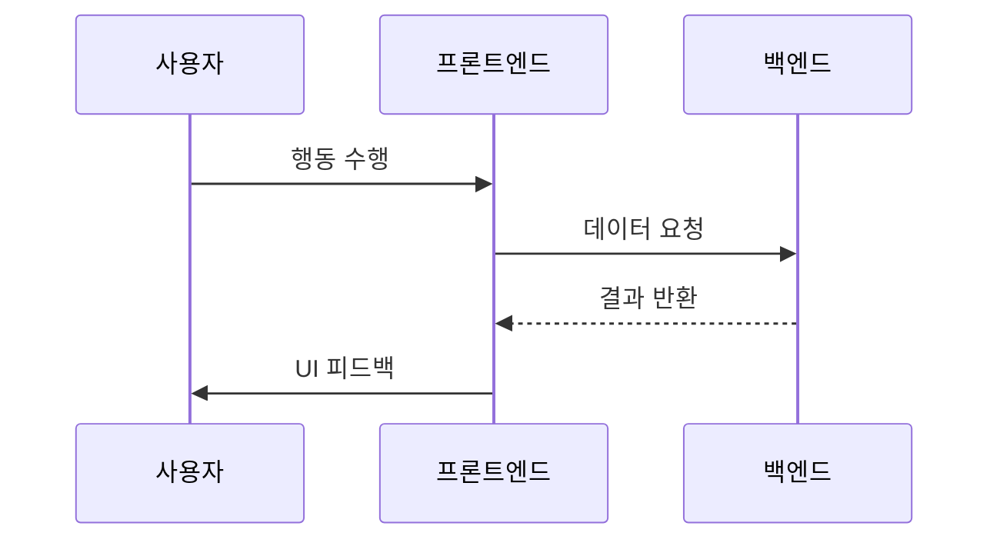

# User Flow: [기능명] (U##)

## 🎯 목적
[이 사용자 흐름이 존재하는 이유를 간략히 서술하세요.]

## 🔗 관련 요구사항 (RTM 추적)
- **P##**: [관련 페이지명]
- **F##**: [관련 Feature명]

## 🔄 사용자 흐름 (Mermaid Diagram)
[이곳에 Interactive Flow(조작/의사결정)는 Flowchart로, 데이터 상호작용은 Sequence Diagram으로 작성하세요.]

## 📝 BDD 시나리오 참조
구체적인 동작 명세(Given/When/Then)는 다음 파일을 참조하십시오:
[해당 feature 파일 경로 링크 기입]
